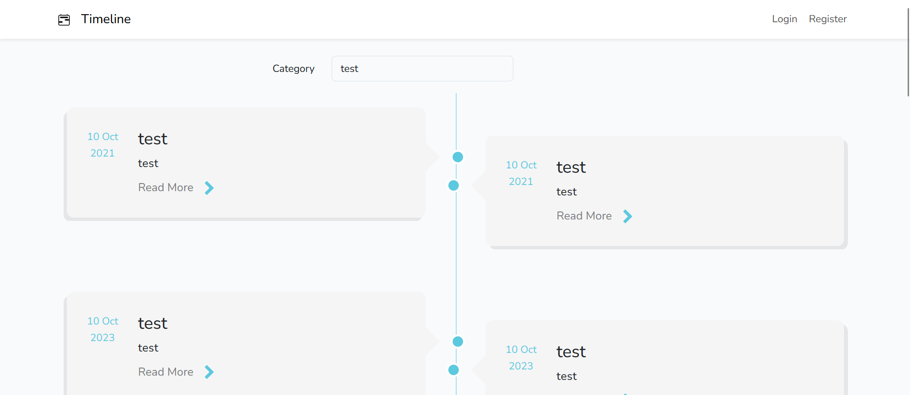

<p align="center"><a href="https://laravel.com" target="_blank"></a></p>

<p align="center">
<a href="https://github.com/laravel/framework/actions"></a>
<a href="https://packagist.org/packages/laravel/framework"></a>
<a href="https://packagist.org/packages/laravel/framework"></a>
<a href="https://packagist.org/packages/laravel/framework"></a>
</p>

# Timeline


## About
Timeline is a simple web application where you can add your own events.

When you are login you can add events and categories for this events.

## Content
- [App examples](./README.md#app-examples)
- [How to run the app?](./README.md#how-to-run-the-app)
  - [Environment](./README.md#environment)
  - [Used technologies](./README.md#used-technologies)
  - [Database](./README.md#database)
  - [Download the app](./README.md#download-the-app)
- [Sources](./README.md#sources)
- [Security](./README.md#security)
- [Note](./README.md#note)
- [License](./README.md#license)
- [Creation time](./README.md#creation-time)

## App examples
Examples of use are in [folder](./external_files/app_examples)

## How to run the app?
### Environment
- Windows 11 Pro v22H2

### Used technologies
- Laravel / Composer / XAMPP
- PHP
- Visual Studio
- Bootstrap
- Nodejs
- MySQL

### Database
- Tinker
- Insert directly in database. Here you can find [folder](./external_files) with examle data to insert.

### Run the app
Download files from githube from this repo
```
git clone https://github.com/Susannnnnna/Laravel_Timeline
```

Download
- XAMPP
- Composer
- Nodejs
- Visual Studio (or any other IDE)

Open app in IDE and run Apache and MySQL via XAMPP

## Sources

## Security

## Note

## License
[MIT license](https://opensource.org/licenses/MIT)
