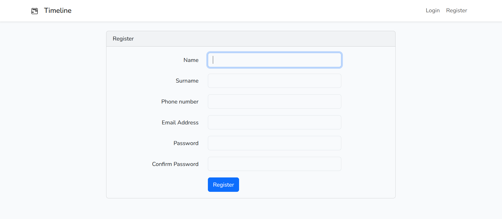
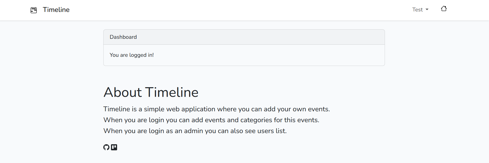
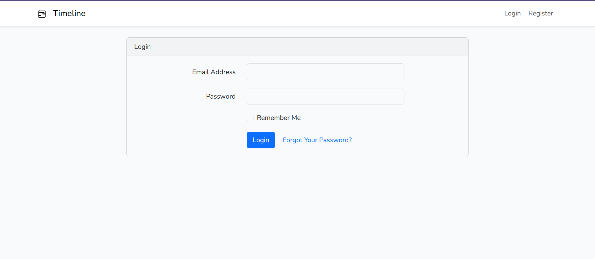
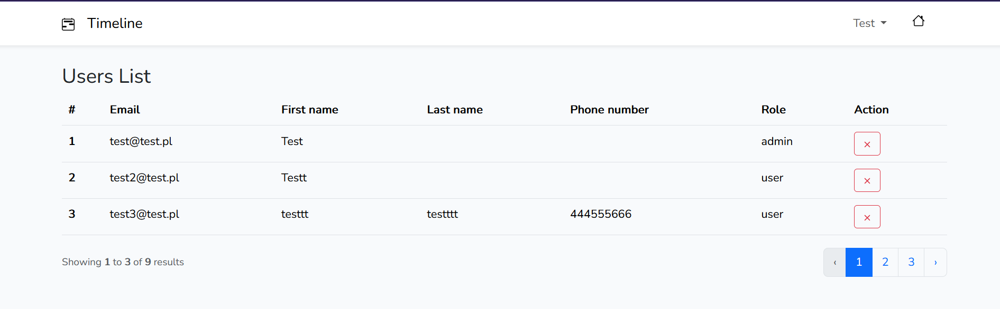
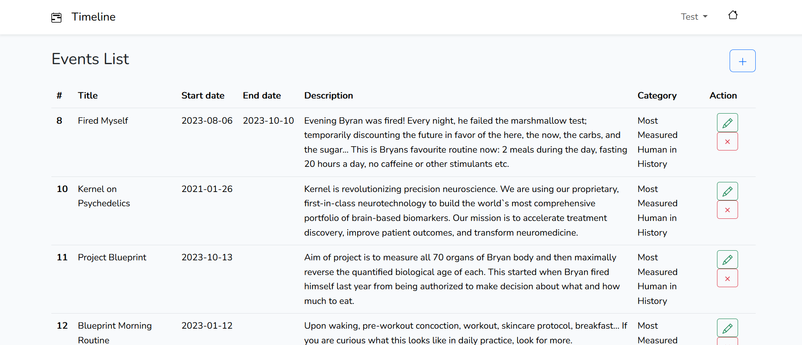
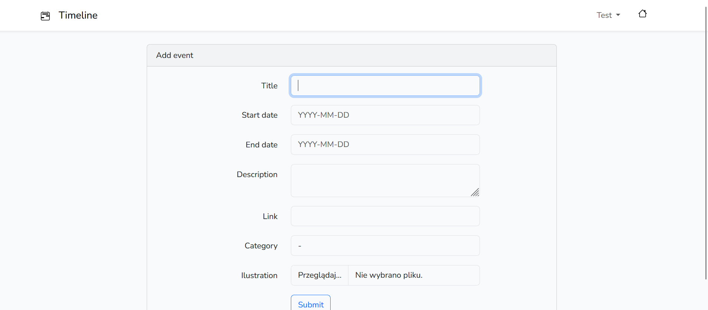
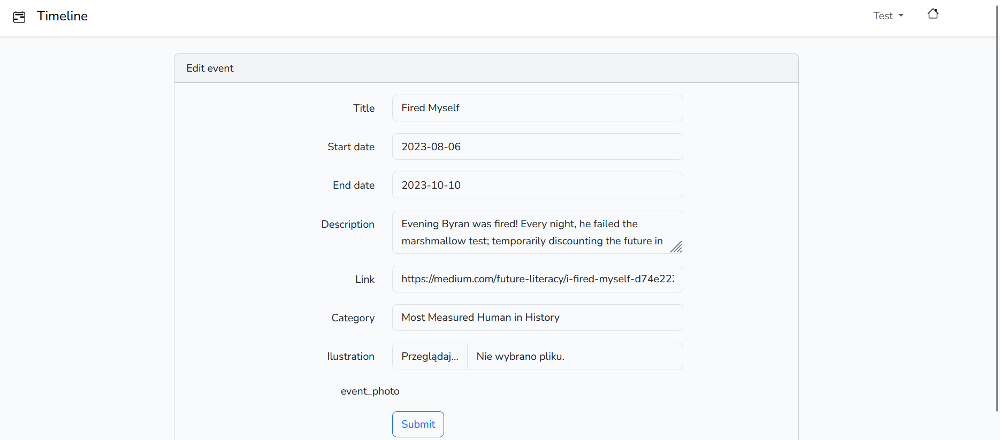
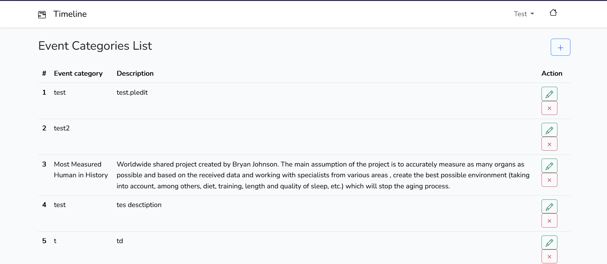

# Timeline - Laravel


## About
Timeline is a simple web application where you can add your own events.

When you are login you can add events and categories for this events.

## Content
- [App examples](./README.md#app-examples)
- [How to run the app?](./README.md#how-to-run-the-app)
  - [Environment](./README.md#environment)
  - [Used technologies](./README.md#used-technologies)
  - [Database and data](./README.md#database-and-data)
  - [Download the app](./README.md#download-the-app)
- [Note](./README.md#note)

## App examples
Examples of use are in [folder](./external_files/app_examples)

















## How to run the app?
### Environment
- Windows 11 Pro v22H2

### Used technologies
- Laravel / Composer / XAMPP
- PHP
- Visual Studio Code
- Bootstrap
- Nodejs
- MySQL

### Database and data
Database name: Timeline

Example data to insert are located in [folder](./external_files).

### Run the app
Download files from github
```
git clone https://github.com/Susannnnnna/Laravel_Timeline
```

Download
- XAMPP
- Composer
- Nodejs
- Visual Studio Code (or any other IDE)
- Bootstrap

Open app in IDE and run Apache and MySQL via XAMPP

## Note
The data visible on the timeline is downloaded from entries available on the website: https://bryan-johnson.medium.com/
